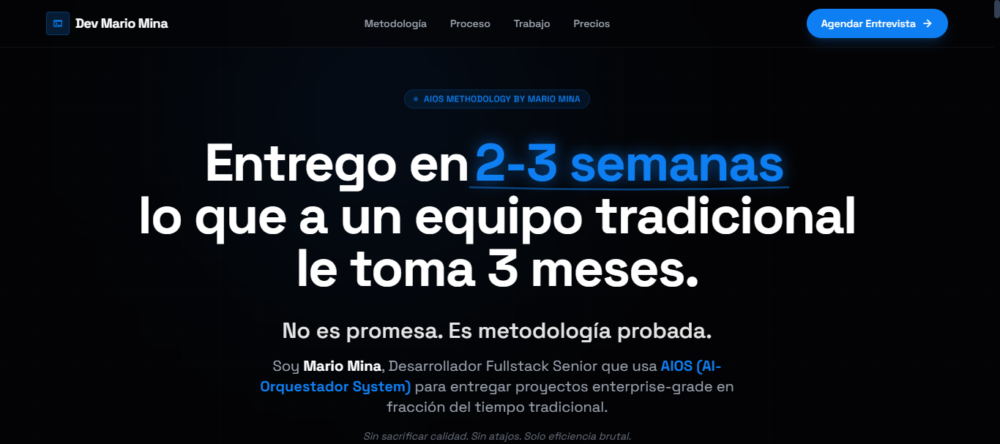

# AI-Engineering Landing Page


**Desarrollador Fullstack Senior - Metodología AIOS**

Landing page de alto impacto diseñada para convertir el CV tradicional en una herramienta de ventas estratégica, posicionando a Mario Mina como socio de desarrollo acelerado para empresas en Ecuador.

---

## 📋 Descripción General

Esta es una **landing page de conversión long-form** que transforma la presentación profesional tradicional en una carta de ventas basada en evidencia. El proyecto aplica técnicas de copywriting de respuesta directa combinadas con diseño moderno para maximizar la conversión de visitantes en entrevistas calificadas.

## 📸 Screenshots

### Hero Section



### Problema que Resuelve

Los desarrolladores senior compiten en un mercado saturado donde:
- Los CVs tradicionales no comunican valor de negocio
- Las empresas buscan velocidad y resultados, no solo habilidades técnicas
- La diferenciación requiere demostración tangible de capacidades

### Público Objetivo

- **Primario:** Dueños de empresas y CTOs en Ecuador que necesitan desarrollo rápido y confiable
- **Secundario:** Empresas de identidad digital que requieren cumplimiento LOPDP
- **Nivel de consciencia:** Problem-aware (frustrados por proyectos lentos y costosos)

---

## ✨ Características Principales

### Estructura de Conversión (11 Secciones)

1. **Hero** - Gancho inicial con propuesta de valor única (velocidad 3x)
2. **Problem Timeline** - Agitación del dolor (desarrollo tradicional lento)
3. **Comparison** - Presentación de metodología AIOS vs. tradicional
4. **Project Deep Dive** - Case study del proyecto LOPDP (evidencia tangible)
5. **Differentiators** - Valor único estratégico (4 diferenciadores clave)
6. **Fit Section** - Cualificación del prospecto (para quién sí/no)
7. **Execution Process** - Proceso de trabajo paso a paso (5 fases)
8. **Pricing** - Inversión y ROI con comparativa honesta
9. **Risk Reversal** - Garantía anti-riesgo (sprint de prueba)
10. **Final CTA** - Cierre de venta directo
11. **Post Script** - Manejo de objeciones finales

### Componentes Interactivos

- **Scroll Progress Bar** - Indicador visual de progreso de lectura
- **Floating Back-to-Top Button** - Navegación rápida al inicio
- **Smooth Scrolling** - Transiciones suaves entre secciones
- **Responsive Navigation** - Menú adaptativo con enlaces a secciones clave
- **Interactive Tabs** - Demostración visual del proyecto LOPDP

### Elementos de Diseño

- **Dark Theme Premium** - Fondo `#030305` con acentos neon blue `#0d7ff2`
- **Glassmorphism Cards** - Tarjetas con efecto vidrio y backdrop blur
- **Neon Glow Effects** - Text-shadow y box-shadow para elementos destacados
- **Grid Background Pattern** - Textura sutil de rejilla para profundidad
- **Animated Elements** - Float, pulse y glow animations para engagement

---

## 🛠 Tech Stack

### Frontend
- **React 19.2.4** - Biblioteca UI con hooks modernos
- **TypeScript 5.8.2** - Type safety y mejor DX
- **Vite 6.2.0** - Build tool ultrarrápido con HMR
- **Tailwind CSS 3.x** (CDN) - Utility-first styling

### Tipografía & Iconos
- **Space Grotesk** - Font principal (Google Fonts)
- **Material Symbols Outlined** - Sistema de iconos

### Infraestructura
- **Vite Dev Server** - Desarrollo local en puerto 3000
- **ESM Imports** - React servido vía ESM.sh CDN
- **Environment Variables** - Gestión de API keys vía `.env.local`

### Integraciones Externas
- **WhatsApp Business Link** - CTA directo para agendar entrevistas
- **Autopilot LOPDP Demo** - Proyecto de demostración en Render

---

## 🏗 Arquitectura

### Estructura del Proyecto

```
ai-engineering-lp/
├── components/              # Componentes React modulares
│   ├── Navbar.tsx          # Navegación principal
│   ├── Hero.tsx            # Sección hero con headline
│   ├── ProblemTimeline.tsx # Visualización del problema
│   ├── Comparison.tsx      # Tabla comparativa AIOS vs tradicional
│   ├── ProjectDeepDive.tsx # Case study LOPDP con tabs interactivos
│   ├── Differentiators.tsx # 4 diferenciadores clave
│   ├── FitSection.tsx      # Cualificación de prospecto
│   ├── ExecutionProcess.tsx# Proceso de trabajo en 5 pasos
│   ├── Pricing.tsx         # Modelo de pricing y comparativa
│   ├── RiskReversal.tsx    # Garantía y reducción de riesgo
│   ├── FinalCTA.tsx        # Llamado a la acción final
│   ├── PostScript.tsx      # P.S. y objeciones
│   └── Footer.tsx          # Footer con links y contacto
├── docs/                    # Documentación del proyecto
│   ├── project-brief.md    # Brief estratégico del proyecto
│   ├── pagina-de-ventas.md # Copy completo de la landing
│   └── client-research.md  # Investigación de cliente ideal
├── App.tsx                  # Componente raíz con layout
├── index.tsx               # Entry point de React
├── index.html              # HTML base con config Tailwind
├── vite.config.ts          # Configuración de Vite
├── tsconfig.json           # Configuración de TypeScript
└── package.json            # Dependencias y scripts
```

### Flujo de Datos

1. **Renderizado Inicial** - `index.html` carga React vía ESM imports
2. **Montaje de App** - `App.tsx` orquesta todos los componentes en orden
3. **Scroll Tracking** - `useEffect` hook monitorea scroll para progress bar
4. **Navegación Smooth** - Anchor links con `scroll-behavior: smooth`
5. **Estado Local** - Componentes individuales manejan su propio estado (ej: tabs en ProjectDeepDive)

### Patrones de Diseño

- **Component Composition** - Cada sección es un componente independiente
- **Props-based Configuration** - Componentes reciben data vía props
- **CSS-in-JS via Tailwind** - Estilos inline con clases utility
- **Responsive-first** - Mobile-first approach con breakpoints `md:` y `lg:`

---

## 🚀 Getting Started

### Requisitos Previos

- **Node.js** 18.x o superior
- **npm** 9.x o superior
- Navegador moderno (Chrome, Firefox, Safari, Edge)

### Instalación

1. **Clonar el repositorio**
   ```bash
   git clone <repo-url>
   cd ai-engineering-lp
   ```

2. **Instalar dependencias**
   ```bash
   npm install
   ```

3. **Configurar variables de entorno**
   
   Crear archivo `.env.local` en la raíz:
   ```env
   GEMINI_API_KEY=tu_api_key_aqui
   ```
   
   > **Nota:** Actualmente el proyecto no usa la API de Gemini en runtime, pero está configurada para futuras integraciones.

### Desarrollo Local

**Iniciar servidor de desarrollo:**
```bash
npm run dev
```

La aplicación estará disponible en:
- **Local:** `http://localhost:3000`
- **Network:** `http://192.168.x.x:3000` (accesible desde otros dispositivos en la red)

**Hot Module Replacement (HMR)** está habilitado - los cambios se reflejan instantáneamente.

### Build de Producción

**Generar build optimizado:**
```bash
npm run build
```

Los archivos optimizados se generan en `/dist`:
- HTML minificado
- CSS purgado (solo clases utilizadas)
- JS bundled y tree-shaken
- Assets optimizados

**Preview del build:**
```bash
npm run preview
```

---

## 📜 Scripts Disponibles

| Script | Comando | Descripción |
|--------|---------|-------------|
| **dev** | `npm run dev` | Inicia servidor de desarrollo en puerto 3000 |
| **build** | `npm run build` | Genera build de producción optimizado |
| **preview** | `npm run preview` | Sirve el build de producción localmente |

---

## 🧪 Testing

Actualmente el proyecto **no incluye tests automatizados**. 

### Roadmap de Testing

- [ ] Configurar Vitest para unit tests
- [ ] Tests de componentes con React Testing Library
- [ ] Tests E2E con Playwright
- [ ] Visual regression testing con Percy/Chromatic

---

## 🌐 Deployment

### Opción 1: Vercel (Recomendado)

1. **Conectar repositorio en Vercel**
2. **Configurar build settings:**
   - Build Command: `npm run build`
   - Output Directory: `dist`
   - Install Command: `npm install`
3. **Agregar variables de entorno** (si aplica)
4. **Deploy automático** en cada push a `main`

### Opción 2: Netlify

1. **Conectar repositorio en Netlify**
2. **Build settings:**
   - Build command: `npm run build`
   - Publish directory: `dist`
3. **Deploy**

### Opción 3: Render (Actual)

El proyecto está configurado para deployment en Render:
- **Tipo:** Static Site
- **Build Command:** `npm run build`
- **Publish Directory:** `dist`

### Opción 4: GitHub Pages

```bash
# Agregar script en package.json
"deploy": "vite build && gh-pages -d dist"

# Instalar gh-pages
npm install --save-dev gh-pages

# Deploy
npm run deploy
```

---

## 🗺 Roadmap

### Fase 1: Optimización de Conversión
- [ ] Implementar A/B testing en headlines principales
- [ ] Agregar heatmaps (Hotjar/Microsoft Clarity)
- [ ] Optimizar tiempo de carga (lazy loading de imágenes)
- [ ] Implementar analytics (Google Analytics 4 o Plausible)

### Fase 2: Interactividad Avanzada
- [ ] Calculadora de ROI interactiva
- [ ] Video demo del proceso AIOS
- [ ] Testimonios en video de clientes
- [ ] Chat widget para preguntas frecuentes

### Fase 3: Personalización
- [ ] Detección de industria del visitante
- [ ] Copy dinámico basado en fuente de tráfico
- [ ] Formulario de calificación previo a agendar

### Fase 4: Integración CRM
- [ ] Webhook a HubSpot/Pipedrive al agendar entrevista
- [ ] Email automation post-visita
- [ ] Lead scoring automático

### Fase 5: Internacionalización
- [ ] Versión en inglés para mercado LATAM
- [ ] Detección automática de idioma
- [ ] SEO multiidioma

---

## 👤 Autor

**Mario Mina**  
Desarrollador Fullstack Senior | Metodología AIOS

- **LinkedIn:** [Perfil de Mario Mina](#)
- **GitHub:** [@mariomina](#)
- **Email:** contacto@mariomina.dev
- **WhatsApp:** [Agendar Entrevista](https://wa.link/4dfafr)
- **Demo LOPDP:** [https://autopiloto-lopdp.onrender.com](https://autopiloto-lopdp.onrender.com)

---

## 📄 Licencia

Este proyecto es propiedad privada de Mario Mina. Todos los derechos reservados.

---

## 🙏 Agradecimientos

- **AIOS Framework** - Metodología de desarrollo acelerado
- **ENEXT** - Cliente objetivo para caso de estudio LOPDP
- **Comunidad React** - Por las herramientas open-source

---

**Última actualización:** Febrero 2026  
**Versión:** 1.0.0  
**Estado:** En producción activa
